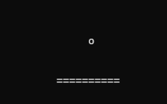
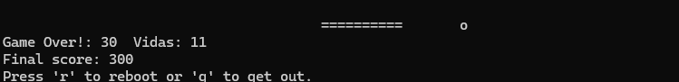
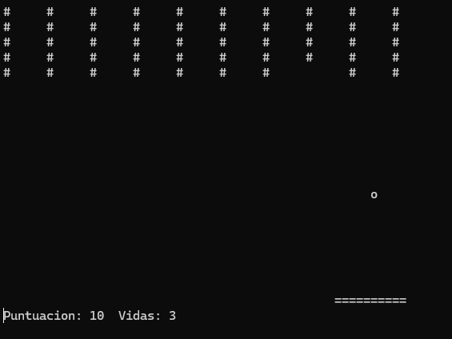
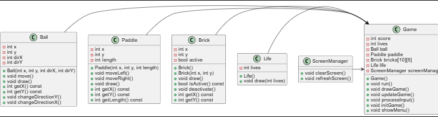
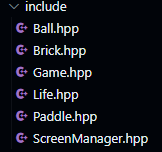
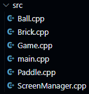

# brickbreacker
## English and Programming Project
### A bit of the history of the game
### Brickbreacker is a retro game that we all know and have played at some time, created in 1976 and inspired by the game "pong", breakout was the bases for many later games. Well, it is based on three objects only, a ball, a paddle and bricks that you must break, and how will you do it? Simple, with the ball. 
##
### Ball
### The ball is everything in the game, it is the object that will make you progress in the game, with the ball you must break the bricks but it is not as simple as it seems, you must prevent the ball from falling, with what? With the paddle.

##
### Paddle
### The paddle is the object that you control in the game, it is your only way to not lose in the game, you have three lives only, if you lose one the game restarts and you will have to break the bricks again then everything will be down to your dexterity to avoid the ball to go away and lose your score.

 ##
 ### Brick
 ### The brick is what you must break with the ball and the paddle, to win you must break each and every one of the bricks, each brick will give you score.
 
##
 ### Here is a video of the videogame
<video controls src="Ball.cpp - proyecto-breakout [Codespaces_ glowing space spork] - Visual Studio Code y 4 páginas más - Personal_ Microsoft​ Edge 2024-06-20 00-19-45.mp4" title="Title"></video>

##
### UML diagram

##
### Folder hpp

##
### Folder src

##
### This program on github is executed using the "make run" command, using the SFML, nsources libraries, among other libraries that are used in C++